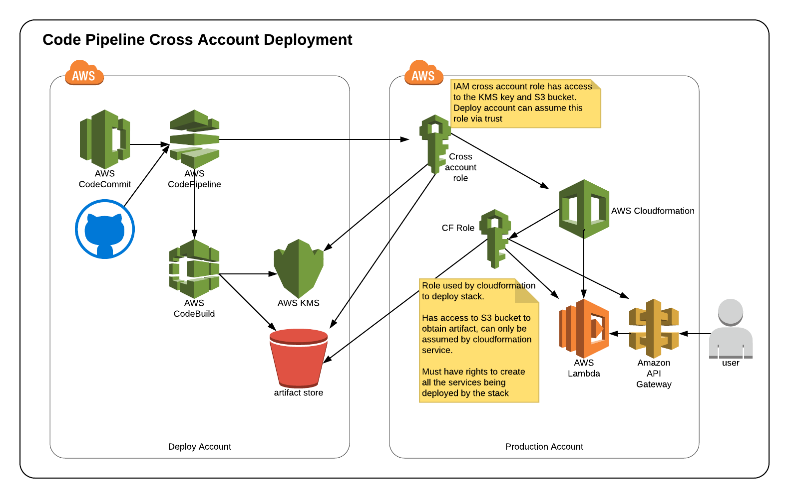

# AWS Code Pipeline to Cross Account Deployments
---
AWS Code Pipeline is a powerful CI/DC tool that can perform deployments across AWS accounts. 
Sadly however, the current available documentation and examples are complete rubbish. 

Below is a reference to myself on getting this working and a resource for others. 

In this example we have 1 account that runs the pipeline, gets the code, performs the build, and the another account that we deploy into. In this example we only have two accounts, but fairly easily this could be expanded to many accounts. 

---
### Getting this working 

At time of writing there is **ZERO** support in the AWS Console for setting this up in codepipeline. 
Options are, CLI and cloudformation, here I'm using yml based cloudformation templates.

*warning, in some places I've used overly board permissions (ie admin * * ) which is bad! Please tune the permissions to match the services your are using and deploying to. Maybe after you've got it all working first :)*

The templates are broken into two folders and should be deployed in the older listed here
 #### 1. Deploy Account: 
 contains templates that need to be used in the following order
 1. *kms-cross-account.yml* - creates the KMS key and allows access from the Production account
 2. *code-build.yml* - sets up the codebuild job and exports the name via CFN export - you will need to customise this to your application build
 3. *code-pipeline.yml* - Sets up the code pipeline job itself (it won't work yet however)

#### 2. Production Account: (actually all and any other accounts we want to deploy into) 
1. *iam-codepipeline-cross-account-deploy.yml* - Sets up two IAM roles, one for codepipleine to access from the deploy account and another thats used to run the cloudformation deploy.

#### 3 One more thing
Yes I said its all CF. Well its mostly CF, because this bit won't work with CF unless I create you a new bucket and well that's probably not ideal. 

You need to add a cross account bucket policy to your S3 bucket (the artifact store). 

The JSON below shows that bucket policy, Replace **YOURBUCKETNAMEHERE** with your artifact bucket name and **ProductionAccountNumber** with the number of your Production account. 

Obviously if you had multiple accounts that you were going to deploy into, make sure each one of them is represented here. 
*The two Deny items get put into buckets by default when using code pipeline console by AWS. I've left them here and haven't yet worked out if CP will break if you remove them!*

```JSON
{
    "Version": "2012-10-17",
    "Id": "SSEAndSSLPolicy",
    "Statement": [
        {
            "Sid": "DenyUnEncryptedObjectUploads",
            "Effect": "Deny",
            "Principal": "*",
            "Action": "s3:PutObject",
            "Resource": "arn:aws:s3:::YOURBUCKETNAMEHERE/*",
            "Condition": {
                "StringNotEquals": {
                    "s3:x-amz-server-side-encryption": "aws:kms"
                }
            }
        },
        {
            "Sid": "DenyInsecureConnections",
            "Effect": "Deny",
            "Principal": "*",
            "Action": "s3:*",
            "Resource": "arn:aws:s3:::YOURBUCKETNAMEHERE/*",
            "Condition": {
                "Bool": {
                    "aws:SecureTransport": "false"
                }
            }
        },
        {
            "Sid": "",
            "Effect": "Allow",
            "Principal": {
                "AWS": "arn:aws:iam::ProductionAccountNumber:root"
            },
            "Action": [
                "s3:Get*",
                "s3:Put*"
            ],
            "Resource": "arn:aws:s3:::YOURBUCKETNAMEHERE/*"
        },
        {
            "Sid": "",
            "Effect": "Allow",
            "Principal": {
                "AWS": "arn:aws:iam::ProductionAccountNumber:root"
            },
            "Action": "s3:ListBucket",
            "Resource": "arn:aws:s3:::YOURBUCKETNAMEHERE"
        }
    ]
}
```

---

### Other resources
At the time of writing 2018-01-27 I'd found the following resources from AWS:

* https://github.com/awslabs/aws-refarch-cross-account-pipeline - This is actually helpful except there are errors in their templates and it won't deploy (I found issues with their KMS template specifically). Some of the templates also treat the account id as a number, which is great except when your acc id starts with a 0 like several of my accounts do! Additionally it is overly complicated, that said, it is a good reference. I do wish it had a better diagram for how the roles worked, because that is the hard part.

* https://docs.aws.amazon.com/codepipeline/latest/userguide/pipelines-create-cross-account.html - The official documentation - its a bit crap if I'm honest. Very dense, no diagrams, I don't consider myself a beginner and frankly this document wasn't consumable. 